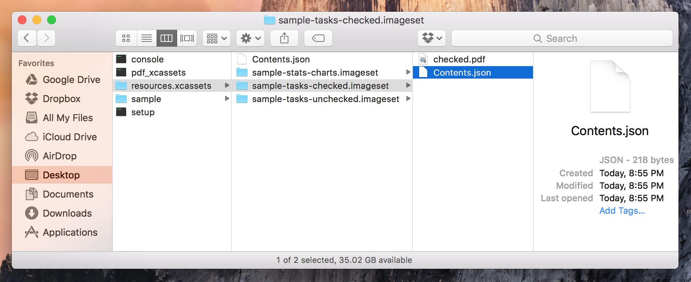

# pdf_xcassets

:train: Generate Xcode `xcassets` for pdf assets.


## Installation

```shell
git clone https://github.com/dkhamsing/pdf_xcassets.git
cd pdf_xcassets
bundle install
# done, run pdf_xcassets from bin/ 😊
```

## Usage

	pdf_xcassets <xcassets name> <assets directory>

```shell
$ pdf_xcassets resources sample/
> Creating xcassets named resources.xcassets
> PDF assets found: 3
> Creating resources.xcassets/Contents.json..
> 1 Processing sample/stats/charts.pdf
  > Creating resources.xcassets/sample-stats-charts.imageset
  > Copying pdf file to imageset
  > Creating Contents.json
> 2 Processing sample/tasks/checked.pdf
  > Creating resources.xcassets/sample-tasks-checked.imageset
  > Copying pdf file to imageset
  > Creating Contents.json
> 3 Processing sample/tasks/unchecked.pdf
  > Creating resources.xcassets/sample-tasks-unchecked.imageset
  > Copying pdf file to imageset
  > Creating Contents.json
> resources.xcassets created
> pdf_xcassets finished 🎉
```



## Credits

- [`json`](pdf_xcassets.gemspec)
- [giphy](http://gph.is/1eZAeAz)

## Contact

- [github.com/dkhamsing](https://github.com/dkhamsing)
- [twitter.com/dkhamsing](https://twitter.com/dkhamsing)

## License

This project is available under the MIT license. See the [LICENSE](LICENSE) file for more info.
